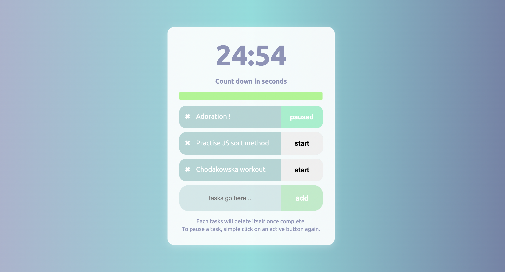
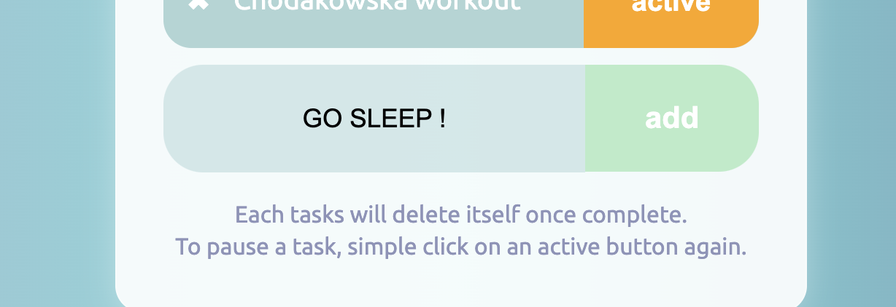
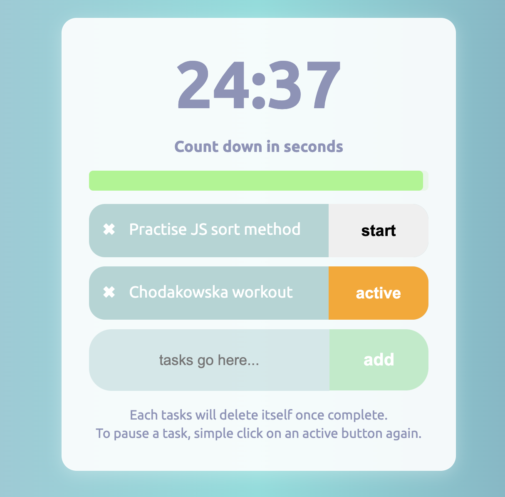

# 🍅 Pomodoro timer 🍅
Huge project for me; hard if I might be honest - countdown, JS syntax practice, objects and converting units. So pround of itHere I could again have practiced countdown (setIntervals() - never enough exercises for this) as well as deleting and adding tasks in JS.

## 🎯 First look 
By default we have 3 tasks... 

another can be easily added as well as deleted.

Then one of them might be activated or paused. And all over again :)

## 🎯 Technologies

+ mostly JavaScript!

## 🎯 Inspiration
This little project is part of an amazing Full Stack Developer Course created by  ♥ Ania Kubow ♥. Love this women, her sense of humor and ability to explain hard, code-things in a way that I finally understand. 🏆
